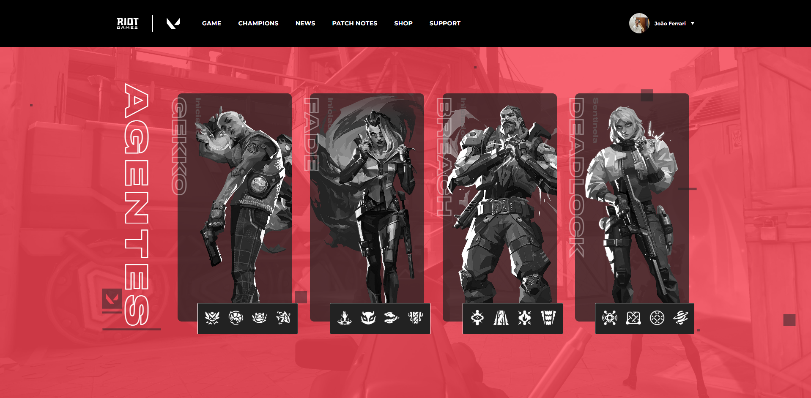

<h1 align="center">
  Valorant
</h1>

<p align="center">
  
</p>

## 💻 Projeto

Este projeto é uma aplicação web que exibe os agentes do jogo Valorant, utilizando a API Valorant. Os usuários podem navegar pela lista de agentes, visualizar detalhes como habilidades, informações de background e outras características. O projeto foi desenvolvido com foco em performance e design responsivo.

## 🚀 Tecnologias

-  [Next.js](https://nextjs.org/)
-  [Sass](https://sass-lang.com/)
-  [TypeScript](https://www.typescriptlang.org/)
-  [API Valorant](https://valorant-api.com/)

## 📔 Conhecimentos abordados

Neste projeto, os seguintes tópicos e práticas foram explorados:
- [x] Utilização de API externa para integração de dados.
- [x] Implementação de interfaces responsivas utilizando Sass.
- [x] Tipagem estática e boas práticas de TypeScript.
- [x] Configuração e otimização de um projeto Next.js.


## 📝 Tarefas Realizadas

- [x] Configuração do ambiente Next.js com TypeScript e Sass.
- [x] Consumo de dados da API Valorant.
- [x] Exibição de detalhes dos agentes com informações dinâmicas.
- [x] Responsividade da aplicação.

## 📂 Estrutura do Projeto

```
├── public/               # Arquivos estáticos como imagens e ícones
├── src/                  # Código fonte principal
│   ├── components/       # Componentes reutilizáveis da aplicação
│   ├── pages/            # Páginas do Next.js
│   ├── services/         # Serviços de integração com a API
│   └── styles/           # Estilos em Sass
├── next.config.js        # Configurações do Next.js
├── package.json          # Dependências e scripts do projeto
├── tsconfig.json         # Configurações do TypeScript
└── README.md             # Documentação do projeto

```

⚙️ Como Executar o Projeto

- I. Clone o repositório:
```
  git clone https://github.com/joaoferrariac/valorant-agents.git
```

- II. Acesse a pasta do projeto:
```
  cd valorant-agents
```

- III. Instale as dependências:
```
  npm install
```

- IV. Execute o servidor de desenvolvimento:
```
  npm run dev
```

- V. Acesse o projeto em http://localhost:3000.